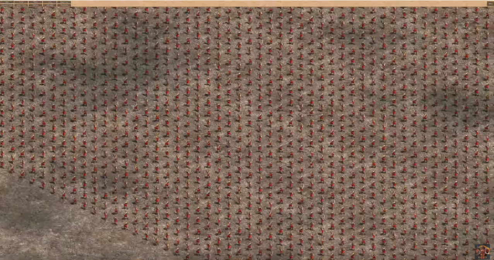

# Time Slicing and Pooling
“Hi, I am [Jordi Pardo](https://www.linkedin.com/in/jordi-pardo-gutierrez), , student of the [Bachelor's Degree in Video Games by UPC at CITM](https://www.citm.upc.edu/ing/estudis/graus-videojocs/). This content is generated for the second year’s subject Project 2, under supervision of lecturer [Marc Garrigó](https://www.linkedin.com/in/mgarrigo/).

# Intro to the problem

In a RTS game we'll be moving a bunch of units across the map. Pathfinding will determinate the path of each unit to reach a destination.
We are using A* to implement this paths, it's pretty fast but it's possible that we'll need to improve this algorithm to fit our game.
Imagine that we want to move 10 units in a small map, our Pathfinding system will probably found the paths so fast, but now, let's imagine that we want to move hundreds of units in a big map, maybe we will notice some kind of lag while our Pathfinding system is calculating those paths.

We'll talk about some methods to try to solve this problem. Time slicing and pooling, let's do this.

# Selected approach

We are sorry, this is a optimitzation topic so, it's difficult to find some media to show you where this problem could appear.

We decide to implement Time Slicing and Pooling.

Time Slicing means to slice the time of the PathFinding to various frames, so you can divide the amount of time for each frame, if a Path is too long for example.
Pooling means to have more than one PathFinder searching paths, you will be able to calculate more than one path at the same time, and you won't need to wait to calculate one path to start calculating another one.

# Handout

### TODO 1:
I made some changes for you from A* base. Just take a look the new class PathFinder.

### TODO 2:

First of all we want to be able to divide our algorithm in different frames. Call IteratePath X number per frame.
Make sure that you change IteratePath to fits this new way of iteration.

### TODO 3:

We're done from the Slicing part, now we'll focus on the Pooling part. 

- Create a vector to store our PathFinders. Remember to add our new PathFinder to this vector. 
- Now check all related functions with PathFinder class and make sure that all of these functions (if needed ) goes through all the vector items.

### Homework

- Implement a queue which will control the amount of incoming path request and delegates them to our PathFinders.
- Improve A* algorithm using vectors instead p2List.
- Add a timer to check how many time our PathFinding system spend calculating paths.

